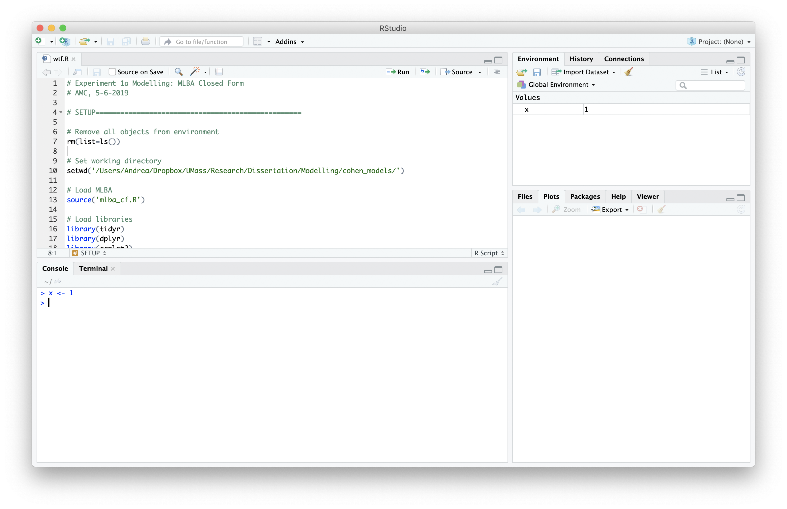

# Introducing R and RStudio




## Pane #1: The R Console

The R console allows you to execute R code (often called expressions, or commands) and see the results printed out. To execute R commands, place your cursor at the prompt (the `>` symbol), type in your code, and press <kbd>Enter</kbd>.

A simple and easy way to demonstrate using R console is to perform some basic arithmetic, just like a calculator. R has 5 basic arithmetic operators:

- `+` for addition
- `-` for subtraction
- `*` for multiplication
- `/` for division
- `^` for exponentiation


```r
2 + 2
## [1] 4
```

R respects the order of operations (i.e. PEMDAS) by default, so if you want to for a specific operation to be executed fist, you need to surround it with parenthesis.

```r
2*10 + 3/10
## [1] 20.3
2*(10 + 3)/10
## [1] 2.6
```

The R console is the best place to start immersing yourself in the language by experimentation. It allows you to "code as you go"; run one command, see what you get, adjust it and test it again. However, the interactive nature of using the R console makes it a poor choice for saving your work to use again later, and for complicated, multi-step operations.

When you know you need to repeat the same step again in the future (i.e. re-use code), or you have a task that requires intermediate steps, you should organize all your code into an R script. RStudio allows you to easily write and interactively test out your R scripts in the **Editor Pane**, which is introduced below.
