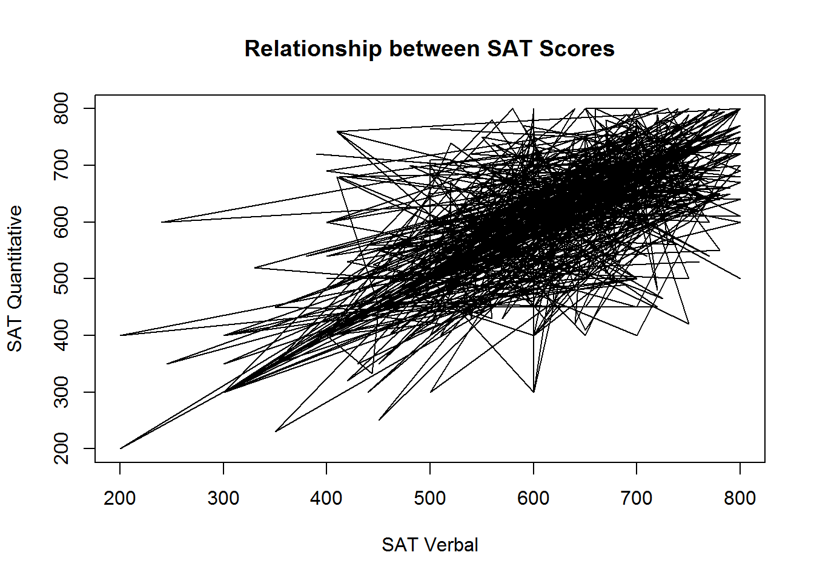
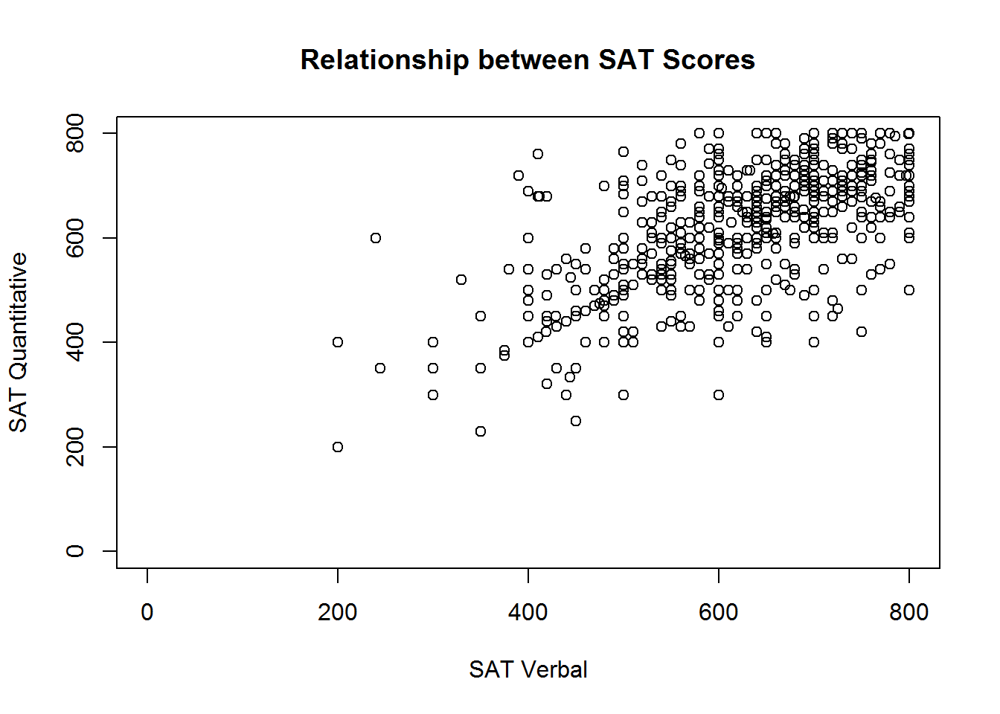
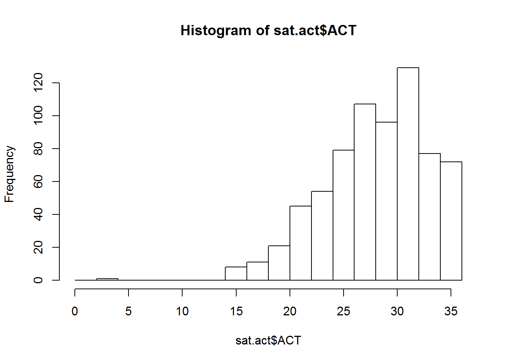
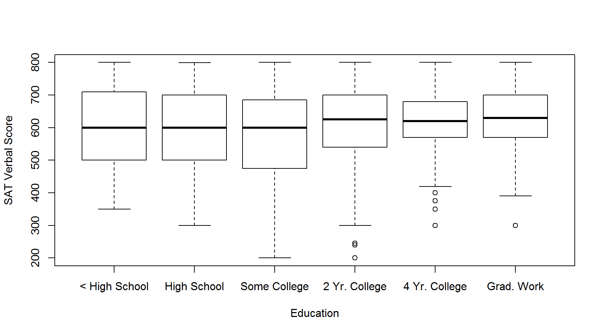
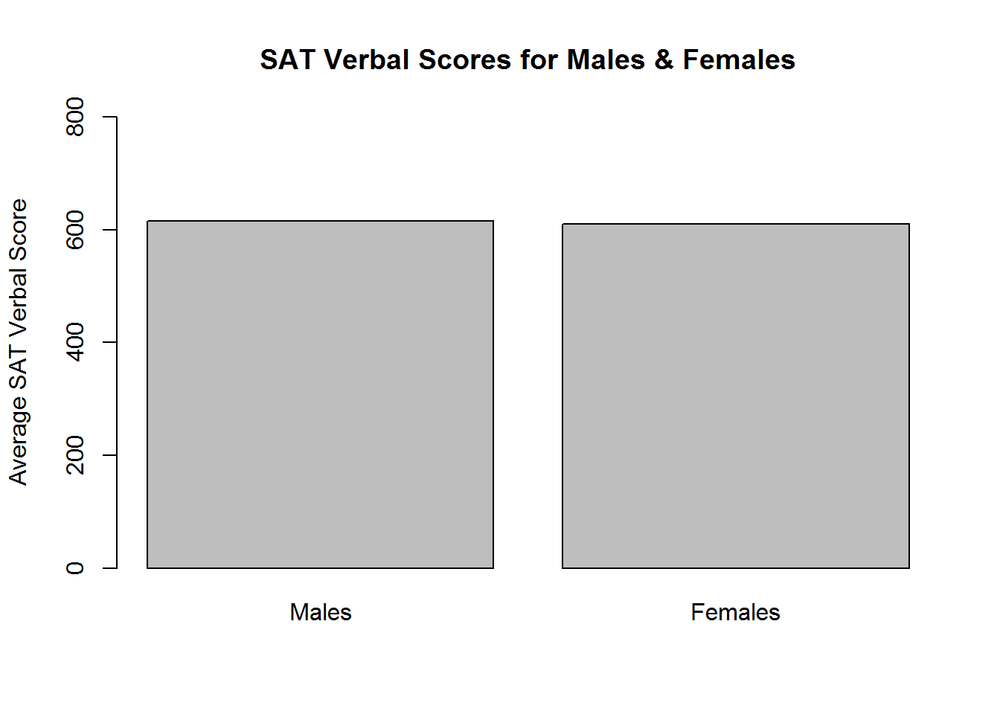

# Statistics


## The Data

We rely on the `sat.act` data set from the `psych` package for all demonstrations in this chapter. 

To make the data set available on your own computer, run the following code:


```r
install.packages('psych')
library(psych)
```

You should now be able to access the `sat.act` data set:


```r
summary(sat.act)
```

```
##      gender        education          age             ACT       
##  Min.   :1.000   Min.   :0.000   Min.   :13.00   Min.   : 3.00  
##  1st Qu.:1.000   1st Qu.:3.000   1st Qu.:19.00   1st Qu.:25.00  
##  Median :2.000   Median :3.000   Median :22.00   Median :29.00  
##  Mean   :1.647   Mean   :3.164   Mean   :25.59   Mean   :28.55  
##  3rd Qu.:2.000   3rd Qu.:4.000   3rd Qu.:29.00   3rd Qu.:32.00  
##  Max.   :2.000   Max.   :5.000   Max.   :65.00   Max.   :36.00  
##                                                                 
##       SATV            SATQ      
##  Min.   :200.0   Min.   :200.0  
##  1st Qu.:550.0   1st Qu.:530.0  
##  Median :620.0   Median :620.0  
##  Mean   :612.2   Mean   :610.2  
##  3rd Qu.:700.0   3rd Qu.:700.0  
##  Max.   :800.0   Max.   :800.0  
##                  NA's   :13
```

As you can see, this data set includes self-reported SAT and ACT scores along with demographic information from 700 respondents. It therefore contains both categorical and continuous variables that are appropriate for both within- and between-subjects analyses. For more information, refer to the help documentation by running the command `?sat.act`.

## Formula Objects

Formulas are special objects in R that are used in a range of functions discussed in this chapter, notably `plot()`, `aov()`, and `lm()`. The use of formulas in these specific functions will be discussed in more detail below, but we first introduce their general properties here. 

The basic structure is as follows:

```y ~ x```

The `y` variable is the dependent variable, the `x` variable is the independent variable, and the `~` operator can be taken to mean "as a function of". Thus, the above example is a formula for "y as a function of x".

For a more concrete example, consider the effect of the independent variable age on the dependent variable ACT scores:

```sat.act$ACT ~ sat.act$age```

We can have multiple independent variables in the formula. For instance, if we wanted to define ACT scores as a function of age and education, we would do so as follows:

```sat.act$ACT ~ sat.act$age + sat.act$education```

The above formula is an example of an "additive" model, in which ACT scores are a function of the additive effects of age and education. To define the interactive model, we would separate age and education by an asterisk instead of a plus sign:

```sat.act$ACT ~ sat.act$age*sat.act$education```

Note that the above formula defines the *full* interactive model, so ACT scores are defined as a function of (1) the main effect of age, (2) the main effect of education, and (3) the interaction of age and education. This same model can be implemented by defining each components separately in the formula object, like this:

```sat.act$ACT ~ sat.act$age + sat.act$education + sat.act$age:sat.act$education```

By defining the components separately, you can pick and choose which to keep. For instance, you could specify only the main effect of age and the interaction of age and education, as follows:

```sat.act$ACT ~ sat.act$age + sat.act$age:sat.act$education```

Formulas can get much more complex than the examples here, which only extend as far necessary for the functions and tests that you are likely to use as an instructor in undergraduate psychology program. A comprehensive tutorial can be found [here](https://www.datacamp.com/community/tutorials/r-formula-tutorial). 

## Descriptive Statistics

### Mean


### Median


### Variance


### Standard Deviation


### Standard Error


### Correlation


### Summary Functions


## Plotting

One of the most compelling reason to learn and use is because it includes highly flexible and powerful tools for visualizing many kinds of data. After all, if a single tool can perform your analyses and create your figures, why not use the "one ring to rule them all"?

Many visualizations can be created using the `plot()` function, so we'll begin our introduction using that function. As you'll soon see, the `plot()` function accepts many arguments, as there are many ways to customize a plot. Many of the other visualization tools in R accept similar arguments. So, if `plot()` accepts an argument, there is a fair chance another function will accept it as well.

### Scatter & Line Plots
If you have two vectors representing pairs of observations, you can plot them against one another in a scatter plot using the `plot()` function. Let's demonstrate this by plotting the SAT Verbal and SAT Quantitative scores from the `sat.act` dataset against one another.


```r
plot(sat.act$SATV, sat.act$SATQ) # Access the columns as vectors using $ syntax
```


The points in the plot above represent pairs SAT Verbal and SAT Quantitative scores. The scores in each vector are paired up by position within each vector - the first value in `SATV` is paired with the first value in `SATQ`, the second value in `SATV` is paired with the second value in `SATQ`, etc. The vector given as the first argument determines the X axis position, and the vector given as the second argument determines the Y axis position.

The axis titles are determined by the variable names of the vectors supplied to the `plot` function. However, variable names aren't always the most informative names for other humans to read. We can customize the axes and plot with informative titles using the `xlab`, `ylab` and `main` arguments for the `plot` function:


```r
plot(sat.act$SATV, sat.act$SATQ,
     xlab = "SAT Verbal", ylab = "SAT Quantitative",
     main = "Relationship between SAT Scores")
```


#### Linetypes, Symbols, and Colors
You can customize the scatterplot to draw lines between the points, or just draw lines without the point symbols with the `type` argument. This is not a sensible thing to do for these data, but we demonstrate it anyway for completeness.


```r
# Lines and points
plot(sat.act$SATV, sat.act$SATQ,
     xlab = "SAT Verbal", ylab = "SAT Quantitative",
     main = "Relationship between SAT Scores",
     type = "o")
```

<div class="figure" style="text-align: center">

<p class="caption">(\#fig:lines1)Points and lines with type='o'</p>
</div>

```r
# Just lines
plot(sat.act$SATV, sat.act$SATQ,
     xlab = "SAT Verbal", ylab = "SAT Quantitative",
     main = "Relationship between SAT Scores",
     type = "l")
```

<div class="figure" style="text-align: center">

<p class="caption">(\#fig:lines2)Just using lines with type='l'</p>
</div>

You can also customize the types of symbols that are used for each point using the `pch`, the style of lines connecting these points using the `lty` argument, and the `col` argument to adjust the color of lines and symbol borders

With the `pch` argument, you specify the symbol used for each point using a numeric code. For example, the value `0` is the code for an unfilled square, while the value `15` is the value for a filled square with no border. Unfortunately, it has been scientifically proven that remembering the code for all the possible symbols is impossible. Luckily, a helpful mnemonic device called a "chart" has been invented to help R programmers customize their plots. This chart is shown below:


Note that if you supply a character instead of a numeric values between 0 and 25, R will use that character as the plotting symbol. So, you could make a plot full of pound signs if you are so inclined!

The `lty` argument has a bit more flexibility. Line types can either be specified as an integer (0=blank, 1=solid (default), 2=dashed, 3=dotted, 4=dotdash, 5=longdash, 6=twodash) or as one of the character strings "blank", "solid", "dashed", "dotted", "dotdash", "longdash", or "twodash".

The `col` argument accepts character string describing either a "built in" color name (see `?colors` for a list) or an RGB triplet encoded in hexadecimal notation. Unless you are intimately familiar with RGB color space, it's a good idea to use a tool like the [W3 Organizations Online Color Picker](https://www.w3schools.com/colors/colors_picker.asp) to help you figure out the RGB hex code for the color you want.

To demonstrate, lets take our original plot (with no lines) and customize it to use unfilled, magenta triangles:

```r
# Lines and points
plot(sat.act$SATV, sat.act$SATQ,
     xlab = "SAT Verbal", ylab = "SAT Quantitative",
     main = "Relationship between SAT Scores",
     col="magenta", pch=2)
```


#### Axis limits
R usually does a good job of determining good values for the range of each axis, but if you wish to override the defaults, you can do do using the `xlim` and `ylim` arguments. These arguments accepts 2-element numeric vectors specifying the minimum and maximum values along each axis (in that order). For example, if we wanted to include 0 in the range of SAT scores shown on the plot, we could use `c(0, 800)` for both our axis limits:


```r
# Lines and points
plot(sat.act$SATV, sat.act$SATQ,
     xlab = "SAT Verbal", ylab = "SAT Quantitative",
     main = "Relationship between SAT Scores",
     xlim = c(0, 800),
     ylim=c(0, 800))
```



This isn't particularly sensible, because 0 is not a possible score on the SAT, so consider this just a demonstration of R's capabilities.

#### Adding to an existing plot
In many cases, it is useful to have *different* symbols, colors, and linetypes on the same plot - for example, to denote observations from different groups. There is more than one way to achieve this effect, but when you want different symbols, colors, and linetypes on the same plot, often the easiest way to do it is plot each group one at a time.

To do this, you begin with the familiar plot command, but use it to plot only a subset of the data. Then, you can use the `points` or `lines` function to add additional points (or lines) to the plot. We'll demonstrate how you can plot the SAT scores for males and females in different colors by subsetting the dataset, and then using the `plot` and `points` functions:


```r
males <- sat.act[sat.act$gender == 1, ]
females <- sat.act[sat.act$gender == 2, ]
plot(males$SATV, males$SATQ,
     xlab = "SAT Verbal", ylab = "SAT Quantitative",
     main = "Relationship between SAT Scores",
     col="red")
points(females$SATV, females$SATQ, col="blue")
```


#### Adding a legend
If you use multiple symbols, colors, and linetypes on the same plot, you'll also need a legend telling the viewer how to interpret the different symbols, colors, and linetypes. You can add legends to an existing plot using the `legend` function. Unfortunately, the `legend` function doesn't know what symbols, colors, and linetypes you've used, or what the different groups in your data are. So, you'll have to re-capitulate this information to the legend function. Make *absolutely* sure that you specify the labels, colors, symbol codes, and linetypes in the exact same order you added them to the plot! You also must specify a `pch` or `linetype` value, even if you used the default value in your plot!

Perhaps the trickiest part about using the legend function is figuring out where to place the legend. The location may also be specified by setting the first argument to the legend function to a single keyword from the set "bottomright", "bottom", "bottomleft", "left", "topleft", "top", "topright", "right" or "center". Alternatively, you can get fine-grained control over the placement by providing two values that represent an x,y coordinate for the top-right corner of the legend:

```r
plot(males$SATV, males$SATQ,
     xlab = "SAT Verbal", ylab = "SAT Quantitative",
     main = "Relationship between SAT Scores",
     col="red")
points(females$SATV, females$SATQ, col="blue")
legend(x=200, y=800,
       legend = c("Males", "Females"),
       col = c("red", "blue"),
       pch=1)
```


#### Adding a regression line
It is often useful to summarize the linear relationship between variables shown in a scatterplot. It is easy to add the "line of best fit" from a linear regression to your scatter plot using the `lm` function (short for "linear model) and the `abline` function (used for drawing straight lines).

The `lm` function performs regression analysis based on the [formula](#formula-objects) you specify. If you intended on adding the regression line to your scatterplot, we recommend you use the same formula to specify your plot, which the `plot` function is more than capable of understanding. The basic steps are:

1. Perform your linear regression with `lm`, and save the output to a variable
2. Create your scatterplot using the same formula specification
3. Prove the `lm` object you saved in Step #1 to the `abline` function.
4. Marvel at your wonderful new plot


```r
regression_results <- lm(SATQ ~ SATV, data=sat.act)
plot(SATQ ~ SATV, data=sat.act,
     xlab = "SAT Verbal", ylab = "SAT Quantitative",
     main = "Relationship between SAT Scores")
abline(regression_results, lwd=2) # lwd = "line width",
```


In the call to `abline` above, we have specified the `lwd` argument, short for "line width", a.k.a. thickness. The default value is 1, and we have double the thickness here so the regression line stands out from the points more.

### Histograms
You can create a histogram showing the counts or proportion of values from a single variable using the `hist` function. 

The `hist` function works with a vector of numeric values, and breaks this vector up into a number of discrete bins. By default, the `hist` function decides what the boundary values of the bins should be, and how many bins should be used, by applying the [Sturges algorithm](https://stat.ethz.ch/R-manual/R-devel/library/grDevices/html/nclass.html). However, you can manually control where the boundaries are placed by providing a vector of boundary values, or by providing a single value specifying the number of bins that should be used. We demonstrate both techniques below in plotting a histogram of ACT scores:


```r
hist(sat.act$ACT, breaks = 30)
```


```r
hist(sat.act$ACT, breaks = seq(0, max(sat.act$ACT), by=2))
```



If you want proportions instead of counts, set the `freq` argument to false. You can also use the same `xlab`, `ylab`, and `main` arguments we used with `plot` to get more informative titles/

```r
hist(sat.act$ACT, breaks = 30, freq=FALSE,
     main = "Distribution of ACT Scores",
     xlab = "ACT Score")
```


### Boxplots
Box plots are a good way to present the shape of distribution of samples from several groups, along with some summary statistics of each group. We can create these plots in R using the `boxplot` function.

If your to-be-plotted data is in a data frame, the best way to instruct the `boxplot` function what variables should be plotted is using a [formula](#formula-objects). If they are not in a data frame, you can provide each to-be-plotted variable as a separate vector. Here, we'll demonstrate the formula interface by plotting the SAT Verbal scores for respondents with education levels. Remember, when using the formula interface, you also have to tell the `boxplot` function what data frame to look for the variables in!


```r
boxplot(SATV ~ education, data=sat.act,
        names=c("< High School", "High School", "Some College",
                "2 Yr. College", "4 Yr. College", "Grad. Work"),
        ylab="SAT Verbal Score", xlab="Education")
```



Note the use of the `names` argument to override the labels on each X axis point.

### Bar plots
Bar plots are used to visualize single summary statistics, like the mean or median across groups. We can create a bar plot in R using the `barplot` function. We'll demonstrate this by plotting the mean SAT Verbal score for males and females. The to-be-plotted value should be specified in a vector or matrix, with one element for each bar you want plotted


```r
SATV_means <- c(mean(sat.act$SATV[sat.act$gender==1]),
                mean(sat.act$SATV[sat.act$gender==2])
                )
names(SATV_means) <- c("Males","Females")
barplot(SATV_means,
        ylim=c(0,800), ylab="Average SAT Verbal Score",
        main="SAT Verbal Scores for Males & Females"
        )
```



### Multiple plots in single figure
In many situations, it is useful to have several different plots in a single figure to facilitate comparison. But in the examples we have encountered so far, each time we create a new plot, it has removed the existing one from out figure window. We can change this behavior to allow multiple figures within the same window by using the `par` function, which changes R's global graphics parameters.

We can set the number of plots that go into a figure window much in the same way we set the dimensions of a matrix - by specifying how many rows of plots there can be, and how many columns of plots there can be. The product of these two values determines the number of plots that are put on a single figure window.

There are two global graphics parameters that allow us to set these dimensions - the `mfrow` parameter, and the `mfcol` parameter. The `mf` stands for "multiple figures", and the `row` or `col` part means the figures are filled in by rows, or by columns. Here, we demonstrate how to use the `mfrow` option to create a 2 by 2 grid of plots, which will allow us to compare the distribution of ACT scores in histograms with different numbers of breaks:


```r
par(mfrow = c(2,2))
hist(sat.act$ACT, breaks = 10, main = "10 breaks")
hist(sat.act$ACT, breaks = 30, main = "30 breaks")
hist(sat.act$ACT, breaks = 50, main = "50 breaks")
hist(sat.act$ACT, breaks = 100, main = "100 breaks")
```


```r
par(mfrow = c(1,1)) # Reset back to default
```
Always make sure to set your `mfrow` or `mfcol` values back to `c(1,1)` afterwards, or *all* subsequent plots will use the same layout!

### Saving Plots
Usually the purpose of creating a visualization in R is to include it in some kind of homework, report, or paper. It is easy to save a plot made in R to an image file on your hard drive using the "Export" option in the R Studio plot pane. Simply click the "Export" drop down menu, and select either the "Save to Image", "Save to PDF" or "Copy to Clipboard" options.


If you choose the "Save as Image" option, you'll get to choose which image format you want to save it as, and what the width and height (in pixels) the image should be saved as.

### What about ggplot?
The [ggplot2 package](https://www.rdocumentation.org/packages/ggplot2/versions/3.1.1) is an extremely popular visualization tool, which provides an alternative to the so-called "base graphics" functions described here. The popularity ggplot has achieved is well deserved - it's visualizations are attractive, and it's data-driven, modular coding style is very powerful. The programming style of ggplot is *very* different from the base graphics style. Perhaps the best way to summarize the ggplot approach is that it is builds on top of the organization of the observations inside a data frame and allows you to "map" the variables in your data frame to the "aesthetics" in a plot (shape, position, color, size, etc.).

We will not cover ggplot here, because it is not a necessity for 240 and 241 (though, in our opinion, a proficient R programmer should know how both ggplot *and* base graphics). However, we will re-iterate the advice the ggplot package authors give for those wishing to learn how to use ggplot:

> If you are new to ggplot2 you are better off starting with a systematic introduction, rather than trying to learn from reading individual documentation pages. Currently, there are three good places to start:
>
> 1. The [data visualisation](http://r4ds.had.co.nz/data-visualisation.html) and [graphics for communication](http://r4ds.had.co.nz/graphics-for-communication.html) chapters in [R for data science](http://r4ds.had.co.nz/).
>
> 2. If you’d like to take an interactive online course, try [Data visualisation with ggplot2](https://www.datacamp.com/courses/data-visualization-with-ggplot2-1) by Rick Scavetta on DataCamp.
>
> 3. If you want to dive into making common graphics as quickly as possible, I recommend [The R Graphics Cookbook](http://amzn.to/2dVfMfn) by Winston Chang.

## Inferential Statistics

### Distribution Functions

The sections below introduce functions for executing common statistical tests. However, R's family of distribution functions also make it possible to explore the underlying probability distributions for each test, and to carry out each test by hand. We therefore begin our demonstration of inferential statistics by giving an overview of these powerful instructional tools. 

The full list of available distributions can be found [here](https://en.wikibooks.org/wiki/R_Programming/Probability_Distributions). The following table provides an overview the distributions that are likely to be relevant to you as an instructor, including the suffix that each distribution is identified by in the functions below:

Distribution | Suffix | Parameters
:-------|:-------|:-------
Normal | `norm` | mean, SD
Student's T | `t` | df, non-centrality
Chi-Square | `chisq` | df, non-centrality (non-negative)
F | `f` | df~1~, df~2~, non-centrality
Binomial | `binom` | size (number of observations), probability
Uniform | `unif` | minimum, maximum

View the help documentation for default parameter values and additional details.

Each distribution can be accessed by a set of four functions, each labelled with the distribution's suffix and a task-specific prefix:

Prefix | Task | Example
:-------|:------------------------------------------------------|:-------
d | Get the probability density associated with a point on the x-axis. | `dnorm()`
p | Get the probability of a value above or below a point on the x-axis. | `pnorm()`
q | Get the x-axis value marking a cumulative probability. | `qnorm()`
r | Get a random sample from the distribution. | `rnorm()`


These functions are each demonstrated in the following sub-sections using the normal distribution. In these examples, consider that IQ scores are meant to be normally distributed with a mean of 100 and a standard deviation of 15:


#### Getting Densities

The functions for getting the probability density associated with a point on the x-axis, such as `dnorm()` in the case of the normal distribution, are unlikely to come up in class. However, they may be useful for generating figures such as the one above, which was created with the following code:


```r
hist(rnorm(10000, mean=100, sd=15), freq=FALSE, ylim=c(0, .03), xlab='', main='IQ Scores')
points(x=seq(40, 160, .001), y=dnorm(seq(40, 160, .001), mean=100, sd=15), type='l', col='red')
```

Note that the input to `dnorm()` was a sequence of values from 40 to 160, by steps of .001. The output was the probability density for each value in the sequence. These values were then used to create a continuous curve that was added to the histogram of the data, in which the argument `freq=FALSE` ensured that the y-axis denoted probability densities instead of counts. A more detailed tutorial is provided [here](https://homepage.divms.uiowa.edu/~luke/classes/STAT4580/histdens.html).

#### Getting Probabilities

You can use `pnorm()` to demonstrate that there is a 9.12% chance of getting an IQ score that is less than or equal to 80:


```r
pnorm(80, mean=100, sd=15)
```

```
## [1] 0.09121122
```

To find the probability of getting a value *greater than* or equal to a cutoff, such as 80, you can either add the argument `lower.tail=FALSE`:


```r
pnorm(80, mean=100, sd=15, lower.tail=FALSE)
```

```
## [1] 0.9087888
```

...or, since the area under the curve sums to 1, you can subtract the output of the previous command from 1:


```r
1-pnorm(80, mean=100, sd=15)
```

```
## [1] 0.9087888
```

The latter method may be better for instructional purposes.

#### Getting Quantiles

You can use `qnorm()` to demonstrate that an IQ score of 124.67 marks the 95^th^ percentile of scores:


```r
qnorm(.95, mean=100, sd=15)
```

```
## [1] 124.6728
```

Similarly, you can add the argument `lower.tail=FALSE` to see the point on the x-axis that marks the *top* 95% of scores:


```r
qnorm(.95, mean=100, sd=15, lower.tail=FALSE)
```

```
## [1] 75.3272
```

Note that subtracting from 1 does not work here as it did with `pnorm()` because the output of `qnorm()` is a quantile, which does not need to sum to 1 as probabilities do.

#### Getting Random Samples

You can use `rnorm()` to randomly sample a class of 50 students from the population of IQ scores:


```r
rnorm(50, mean=100, sd=15)
```

```
##  [1]  88.34978  94.59001  76.77104  83.83402  94.81948  85.26418  98.05681
##  [8] 124.20045 103.68120  99.39780  81.10266 101.82454 115.94468  96.81382
## [15]  96.65950 114.85277 106.01546  76.75924 110.58895  94.92199  99.45198
## [22] 105.72418 114.08677  98.20056 108.21798  95.06323 100.69525 116.84644
## [29] 118.88588  85.38621 121.39220 101.14632 119.12717 119.57454 102.38109
## [36]  92.87468  88.73590  83.21046 101.53561  91.93236 106.91743 120.00010
## [43] 124.49441 114.39422 111.85415  89.28847  87.75988 130.26767  82.50233
## [50] 115.45107
```

#### Running Statistical Tests by Hand

These functions can be used to conduct statistical analyses by hand. Consider a demonstration of a z-test using the functions for the normal distribution. To test whether an IQ score of 135 is significantly different from the mean IQ score, first find the z-score:


```r
IQ135_z <- (135-100)/15
IQ135_z
```

```
## [1] 2.333333
```

You could then compare that z-score to the critical z-scores associated with an alpha of .05, here assuming a two-tailed hypothesis:


```r
qnorm(.025)
```

```
## [1] -1.959964
```

```r
qnorm(.975)
```

```
## [1] 1.959964
```

The z-score of an IQ of 135 is greater than the critical z-score for the upper tail, so we can reject the null hypothesis. Note that for a one-tailed hypothesis, simply use one call to `qnorm()` with .05 or .95 for the lower or upper tail, respectively.

Alternatively, you could find the probability of getting a z-score that if equal to the test score or more extreme (in this case, more positive), and compare that to the alpha value instead of the critical z-score:


```r
IQ135_z_prob <- 1-pnorm(IQ135_z)
```

The probability of getting an IQ of 135 is less than alpha (either .025 for a two-tailed hypothesis or .05 for a one-tailed hypothesis), so we reject the null hypothesis.

Note that you could also apply this method by finding the probability of an IQ of 135 given a mean of 100 and standard deviation of 15, and compare that to the alpha value instead:


```r
IQ135_prob <- 1-pnorm(135, mean=100, sd=15)
```

This provides the same probability as for the z-score, so we make the same conclusion. However, though it uses one line of code instead of two, you may find that this method is more confusing for some students, particularly if they are used to seeing distributions centered on 0 elsewhere in the course. 

This same process can be extended to a range of statistical tests, including t tests, F tests, Chi-Square tests, and binomial tests. 

### `t.test()`

The `t.test()` function can be used to execute one-sample, paired, or two-sample t-tests. Each case is demonstrated below, but first note three general arguments that can be used to augment the test:

Argument | Values
:-------|:--------------------------------------------------------------------
`alternative` | Set to `two.sided` for a two-sided test, `less` for the lower tail, and `greater` for the upper tail; the default is `two.sided`.
`var.equal` | Set to `TRUE` to assume equal variance and `FALSE` otherwise; the default is `FALSE`.
`conf.level` | Provide a number between 0 and 1 to specify the range for the confidence interval; the default is .95.

#### One-sample t-tests

To demonstrate a one-sample t-test, imagine that we are curious whether the average verbal SAT score in the `sat.act` data set is different from 0. We could test that question with the following call:


```r
t.test(sat.act$SATV)
```

```
## 
## 	One Sample t-test
## 
## data:  sat.act$SATV
## t = 143.47, df = 699, p-value < 2.2e-16
## alternative hypothesis: true mean is not equal to 0
## 95 percent confidence interval:
##  603.8560 620.6126
## sample estimates:
## mean of x 
##  612.2343
```

The output of `t.test()` gives us a nice summary of the results, including the t-statistic, degrees of freedom, p-value, and 95% confidence interval. The p-value is essentially 0, so we can reject the null hypothesis that the average verbal SAT score is 0. 

If we wanted to instead see if the average verbal SAT score was different from 650, we could change the null comparison value by setting the `mu` parameter:


```r
t.test(sat.act$SATV, mu=600)
```

```
## 
## 	One Sample t-test
## 
## data:  sat.act$SATV
## t = 2.867, df = 699, p-value = 0.004269
## alternative hypothesis: true mean is not equal to 600
## 95 percent confidence interval:
##  603.8560 620.6126
## sample estimates:
## mean of x 
##  612.2343
```

The p-value is 0.004, so we can reject the null hypothesis that the average verbal SAT score is 600. Instead, it appears to be significantly higher.

#### Paired t-tests

To demonstrate a paired t-test, imagine that we are curious as to whether verbal SAT scores are different from quantitative SAT scores. We can conduct this in one of two ways. 

First, we could calculate the difference score for each pair, then run a one-sample t-test comparing the average difference score to 0:


```r
# Calculate difference scores
sat.act$SAT_diff <- sat.act$SATV-sat.act$SATQ

# Run a one-sample t-test
t.test(sat.act$SAT_diff)
```

```
## 
## 	One Sample t-test
## 
## data:  sat.act$SAT_diff
## t = 0.57483, df = 686, p-value = 0.5656
## alternative hypothesis: true mean is not equal to 0
## 95 percent confidence interval:
##  -5.116109  9.351917
## sample estimates:
## mean of x 
##  2.117904
```

The p-value is .566, so we fail to reject the null hypothesis that the difference between verbal and quantitative SAT scores are approximately zero.

In the second method, we could have `t.test()` compute the difference scores for us by specifying both samples and setting the `paired` argument to `TRUE`:


```r
t.test(sat.act$SATV, sat.act$SATQ, paired=TRUE)
```

```
## 
## 	Paired t-test
## 
## data:  sat.act$SATV and sat.act$SATQ
## t = 0.57483, df = 686, p-value = 0.5656
## alternative hypothesis: true difference in means is not equal to 0
## 95 percent confidence interval:
##  -5.116109  9.351917
## sample estimates:
## mean of the differences 
##                2.117904
```

We get exactly the same result. However, note that though this method uses fewer lines of code it risks obscuring the role of difference scores for the student.

#### Two-sample t-tests

To demonstrate a two-sample t-test, imagine that we are curious as to whether male and female students reported different quantitative SAT scores.

The function call is very similar to the second method for conducting a paired t-test, but we set the `paired` argument to `FALSE` instead:


```r
t.test(sat.act$SATQ[sat.act$gender==1], sat.act$SATQ[sat.act$gender==2], paired=FALSE)
```

```
## 
## 	Welch Two Sample t-test
## 
## data:  sat.act$SATQ[sat.act$gender == 1] and sat.act$SATQ[sat.act$gender == 2]
## t = 4.3544, df = 492.94, p-value = 1.624e-05
## alternative hypothesis: true difference in means is not equal to 0
## 95 percent confidence interval:
##  21.88433 57.87165
## sample estimates:
## mean of x mean of y 
##  635.8735  595.9955
```

The p-value is approximately .00002, so we can reject the null hypothesis that male and female students report essentially the same quantitative SAT scores. Instead, the mean score for males appears to be significantly higher.

Note that the default value for the `paired` argument is `FALSE`, so running the above call with the `paired` argument omitted would produce the same result. However, you might want to encourage students to always specify the argument for a t-test with two samples so that they can be sure they are running the intended test.

Further, note that the above example indexes the male and female groups within the call to `t.test()`, but you could also ask students to do this separately beforehand:


```r
# Subset the groups
male_SATQ <- sat.act$SATQ[sat.act$gender==1]
female_SATQ <- sat.act$SATQ[sat.act$gender==2]

# Run a two-sample t-test
t.test(male_SATQ, female_SATQ, paired=FALSE)
```

```
## 
## 	Welch Two Sample t-test
## 
## data:  male_SATQ and female_SATQ
## t = 4.3544, df = 492.94, p-value = 1.624e-05
## alternative hypothesis: true difference in means is not equal to 0
## 95 percent confidence interval:
##  21.88433 57.87165
## sample estimates:
## mean of x mean of y 
##  635.8735  595.9955
```

### `aov()`

The `aov()` command can be used to execute an ANOVA. The basic call includes one argument, which is a formula object. Whether `aov()` is used to run a one-way, two-way, or multi-way ANOVA, with or without interaction terms, is based entirely on the formula.

#### One-way ANOVA

To demonstrate a one-way ANOVA, imagine that we are curious as to whether verbal SAT scores vary across education level:


```r
aov(sat.act$SATV ~ sat.act$education)
```

```
## Call:
##    aov(formula = sat.act$SATV ~ sat.act$education)
## 
## Terms:
##                 sat.act$education Residuals
## Sum of Squares              19247   8890899
## Deg. of Freedom                 1       698
## 
## Residual standard error: 112.8613
## Estimated effects may be unbalanced
```

The standard output of aov does not contain readily interpretable results. To get the ANOVA table, it is better to save the output of `aov()`, then call `summary()` on that saved object:


```r
educ_aov <- aov(sat.act$SATV ~ sat.act$education)
summary(educ_aov)
```

```
##                    Df  Sum Sq Mean Sq F value Pr(>F)
## sat.act$education   1   19247   19247   1.511  0.219
## Residuals         698 8890899   12738
```

Now we can see that the p-value is greater than an alpha of .05, so we fail to reject the null hypothesis that verbal SAT scores are equal across levels of education.

We might neaten up our code a bit by using the `data` argument to specify the data frame that our variables belong to. This allows us to just use the column names in the formula object:


```r
educ_aov <- aov(SATV ~ education, data=sat.act)
summary(educ_aov)
```

```
##              Df  Sum Sq Mean Sq F value Pr(>F)
## education     1   19247   19247   1.511  0.219
## Residuals   698 8890899   12738
```

#### Two-way ANOVA

To demonstrate a two-way ANOVA, imagine that we are curious as to whether quantitative SAT scores vary across levels of education and gender:


```r
educ_gender_aov <- aov(SATQ ~ education + gender, data=sat.act)
summary(educ_gender_aov)
```

```
##              Df  Sum Sq Mean Sq F value   Pr(>F)    
## education     1   10998   10998   0.845    0.358    
## gender        1  261978  261978  20.133 8.47e-06 ***
## Residuals   684 8900522   13012                     
## ---
## Signif. codes:  0 '***' 0.001 '**' 0.01 '*' 0.05 '.' 0.1 ' ' 1
## 13 observations deleted due to missingness
```

The p-value for education is .358, so we fail to reject the null hypothesis that quantitative SAT scores are equal across levels of education. The p-value for gender, however, is approximately zero, so we can reject the null hypothesis that quantitative SAT scores are equal across genders. To determine which gender has the highest scores, you might have your students find the means or create a barplot.

The two-way ANOVA that we just ran assumed an additive model, but perhaps we think that the effect of gender on quantitative SAT scores is different across different levels of education. To test this hypothesis with the interactive model, change the `+` symbol between the independent variables to an `*`:


```r
educ_gender_aov_int <- aov(SATQ ~ education * gender, data=sat.act)
summary(educ_gender_aov_int)
```

```
##                   Df  Sum Sq Mean Sq F value   Pr(>F)    
## education          1   10998   10998   0.844    0.358    
## gender             1  261978  261978  20.111 8.57e-06 ***
## education:gender   1    3396    3396   0.261    0.610    
## Residuals        683 8897126   13027                     
## ---
## Signif. codes:  0 '***' 0.001 '**' 0.01 '*' 0.05 '.' 0.1 ' ' 1
## 13 observations deleted due to missingness
```

The p-value for the interaction term is .610, so we fail to reject the null hypothesis that the effect of gender on quantitative SAT scores is the same across levels of education.

### `cor.test()`


### `binom.test()`


### `chisq.test()`


### `lm()`


### Confidence Intervals


